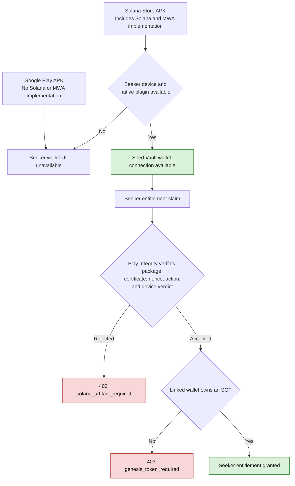

# Mobile Store Release

Aeldrune ships to iOS and Android through Capacitor. The native apps
bundle the built Vite client and connect to the production backend at
`https://worldofclaudecraft.com`.

## Prerequisites

- Xcode for iOS archives.
- Android Studio plus JDK 21 for Capacitor 8 Android builds.
- Existing Apple and Google organization developer accounts.
- Cloudflare Turnstile must allow the native WebView origins used by Capacitor:
  `capacitor://localhost` for iOS and `http://localhost` for Android.

## Versioning

The app version lives in three files that must stay in lockstep:

| File | Field(s) |
|---|---|
| `package.json` | `version` |
| `android/app/build.gradle` | `versionName`, `versionCode` |
| `ios/App/App.xcodeproj/project.pbxproj` | `MARKETING_VERSION`, `CURRENT_PROJECT_VERSION` |

Do not edit these by hand. Bump them all in one step with npm's built-in
`version` command, which fires the `version` lifecycle hook
(`scripts/version_sync.mjs`) and folds the native files into the same commit and
tag:

```sh
npm version 0.15.0        # exact version
npm version minor         # or patch / major
```

This sets the marketing version (`version` / `versionName` / `MARKETING_VERSION`)
to the new semver across all three files and increments the native build numbers
(`versionCode` / `CURRENT_PROJECT_VERSION`), which the App Store and Play Store
require to strictly increase on every upload.

To resync the native manifests to the current `package.json` version without
cutting a release commit (e.g. after a manual edit), run:

```sh
npm run version:sync
```

## Commands

```sh
npm run native:sync
npm run native:open:ios
npm run native:open:android
```

`native:sync` runs a native build of the web app with:

```sh
VITE_NATIVE_APP=1
VITE_API_ORIGIN=https://worldofclaudecraft.com
```

The copied web assets under the native projects are generated and ignored by git.
Run `npm run native:sync` before opening Xcode or Android Studio for a release
archive.

For local testing on a physical phone, point the native build at the server
running on the development machine's LAN IP:

```sh
VITE_API_ORIGIN=http://192.168.1.247 npm run native:sync
```

Replace the IP with the Mac's current Wi-Fi/LAN address. Do not use
`localhost` for a physical phone; that resolves to the phone itself.

## Android Distribution Flavors, Signing, and Play Integrity

Android has two distribution flavors with different packaged capabilities:

| Variant | Distribution | Native Solana / MWA code |
|---|---|---|
| `playRelease` | Google Play | Excluded |
| `solanaStoreRelease` | Solana dApp Store | Included |



The flavor and device checks control packaged capability and client UI. They
do not authorize the server route. Seeker entitlement requires both the
purpose-specific signed-artifact proof and the independent server-side SGT
ownership check.

`BuildConfig.SOLANA_MOBILE_DISTRIBUTION`, Seeker model checks, and native plugin
availability control client UI and packaged code. They are not server
authorization evidence. Seeker entitlement claim and native Daily Rewards spin
are authorized separately by a purpose-specific Play Integrity verdict and
server-side SGT ownership verification.

### Release signing contract

Prepare two distinct production signing identities:

- Google Play installs are signed with the **Google Play App Signing
  certificate**. This is not necessarily the upload-key certificate.
- Solana dApp Store releases are signed with a dedicated **Solana Store release
  certificate**.

The server allowlist must contain only the base64url SHA-256 digest of the
Solana Store release certificate. Do not add the Google Play App Signing
certificate, Play upload certificate, or an Android Debug certificate.

The certificate distinction is security-critical. If both artifacts use the
same package name and signing certificate, the server cannot cryptographically
distinguish the Play artifact from the Solana Store artifact. Debug variants
normally share the Android Debug certificate and therefore cannot prove this
production boundary.

Android permits an installed app to be updated only by an artifact signed by a
compatible signing identity. Because the two store artifacts intentionally use
different signing certificates, switching between the Play and Solana Store
tracks is not an in-place update. It normally requires uninstalling the
existing app first, which removes local app data. Document this limitation in
store and support guidance before release.

Keep every keystore, key password, service-account credential, and signing
configuration secret out of Git, build logs, screenshots, PR descriptions, and
release notes. A certificate fingerprint is public metadata, but the keystore
and its private key are secrets.

### Play Integrity project

Play Integrity requires a Google Cloud project with the Play Integrity API
enabled. For the Solana Store artifact, which is distributed outside Google
Play, set that project's numeric project number before building:

PowerShell:

```powershell
$env:PLAY_INTEGRITY_CLOUD_PROJECT_NUMBER="REPLACE_WITH_PROJECT_NUMBER"
npm.cmd run native:sync
npm.cmd run native:open:android
```

POSIX shell:

```sh
export PLAY_INTEGRITY_CLOUD_PROJECT_NUMBER=REPLACE_WITH_PROJECT_NUMBER
npm run native:sync
npm run native:open:android
```

The value is compiled into the Android artifact through
`BuildConfig.PLAY_INTEGRITY_CLOUD_PROJECT_NUMBER`. Changing it requires a new
native build and reinstall; changing only the server environment does not
update an existing APK. Launch Android Studio from the same environment, or set
the variable in the release build environment; an already-running Android
Studio process does not inherit later shell changes.

The server must authenticate `decodeIntegrityToken` with a service account from
the same Cloud project. Configure the deployment secret through
`GOOGLE_PLAY_INTEGRITY_SERVICE_ACCOUNT_JSON`, or through the separately
supported client-email and signing-PEM environment variables. Never commit
these values. The server also requires:

```env
SEEKER_SOLANA_INTEGRITY_PACKAGE_NAME=com.worldofclaudecraft
SEEKER_SOLANA_INTEGRITY_CERT_DIGESTS=<SOLANA_STORE_RELEASE_CERT_BASE64URL_SHA256>
SEEKER_SOLANA_INTEGRITY_DEVICE_VERDICT=MEETS_DEVICE_INTEGRITY
```

Native Android authentication accepts two separate artifact policies. Google
Play builds must return `PLAY_RECOGNIZED` and match the Google Play certificate
allowlist. Direct-distributed Solana Store builds may return
`UNRECOGNIZED_VERSION`, but are accepted only when their package and signing
certificate exactly match the separate `SEEKER_SOLANA_INTEGRITY_*` allowlist.
Both paths still require the server-issued nonce and configured device verdict.

Missing service-account credentials, package configuration, or certificate
allowlist intentionally fails Solana Store native authentication, Seeker claim,
and native spin closed. Seeker claim and spin report
`seeker.solana_artifact_required` for the artifact-verification failure.

Play Integrity verifies the signed artifact and device signals; it does not
prove that the APK was downloaded from the Solana dApp Store. A correctly
signed and allowlisted Solana Store APK remains valid when sideloaded.

### Generate and inspect the signed artifacts

Run `npm run native:sync`, open the Android project, and use Android Studio's
**Generate Signed Bundle / APK** workflow. Select the intended flavor and its
matching signing identity:

- `playRelease`: build the artifact intended for Google Play. The final
  certificate used for the installed artifact is the Play App Signing
  certificate shown by Play Console.
- `solanaStoreRelease`: build an APK signed with the dedicated Solana Store
  release keystore.

Do not treat an unsigned `assembleSolanaStoreRelease` output as a shippable
artifact. Verify the actual APK that will be uploaded:

```powershell
$buildTools = Get-ChildItem "$env:LOCALAPPDATA\Android\Sdk\build-tools" -Directory |
  Sort-Object Name -Descending |
  Select-Object -First 1
$apkSigner = Join-Path $buildTools.FullName "apksigner.bat"
$apkPath = Resolve-Path ".\android\app\build\outputs\apk\solanaStore\release\app-solanaStore-release.apk"

& $apkSigner verify --print-certs $apkPath
```

If Android Studio wrote the signed APK elsewhere, replace `$apkPath` with that
exact artifact path. Convert the reported hexadecimal SHA-256 certificate
digest to the base64url representation returned by Play Integrity:

```powershell
$hexDigest = "REPLACE_WITH_APKSIGNER_SHA256_HEX"
node -e "console.log(Buffer.from(process.argv[1].replaceAll(':', ''), 'hex').toString('base64url'))" $hexDigest
```

Set the resulting value in
`SEEKER_SOLANA_INTEGRITY_CERT_DIGESTS`, restart the server, and verify a decoded
production verdict before release. Do not copy a hexadecimal fingerprint
directly into the base64url allowlist.

### Android release checks

Inspect both resolved runtime classpaths before building the final artifacts:

```powershell
cd android

.\gradlew.bat :app:dependencies `
  --configuration playDebugRuntimeClasspath |
  Select-String 'com\.solanamobile|io\.github\.funkatronics'

.\gradlew.bat :app:dependencies `
  --configuration solanaStoreDebugRuntimeClasspath |
  Select-String 'com\.solanamobile|io\.github\.funkatronics'
```

The Play command must produce no matching dependency. The Solana Store command
must show the intended MWA implementation. This source-level check does not
replace inspection of the final signed release APK. Use Android Studio's
**Analyze APK** view to confirm that the Play DEX/class inventory does not
contain `NativeSolanaMobilePlugin`, `com.solanamobile`, or
`io.github.funkatronics`, and perform the inverse check on the Solana Store APK.
In a running Play build, this browser-console probe must also return `false`:

```js
window.Capacitor?.isPluginAvailable?.('NativeSolanaMobile')
```

Before shipping:

- Confirm the Play runtime dependency graph, DEX/class inventory, merged
  manifest, and Capacitor registration contain no Solana/MWA implementation or
  `NativeSolanaMobilePlugin`.
- Confirm the Solana Store artifact contains the intended MWA dependencies and
  native plugin.
- Confirm the final Play App Signing and Solana Store release certificate
  digests are different.
- Confirm only the Solana Store release digest is configured in the Seeker
  server allowlist.
- Confirm no Debug certificate digest or private signing material is present in
  production configuration.
- Confirm a Solana Store artifact with the allowlisted signature can claim
  entitlement, while iOS, the Play artifact, missing proof, a mismatched
  package, and a mismatched certificate fail closed.
- Confirm native Daily Rewards spin requires a fresh `seeker-spin` proof,
  existing entitlement, and current ownership of the claimed SGT mint.

### Solana Store MWA credential storage

Only the Solana Store flavor persists the reusable MWA authorization token. It
encrypts the token with a non-exportable Android Keystore AES-GCM key and stores
only the authenticated ciphertext envelope. The Play flavor contains neither
the token-store implementation nor the MWA-specific backup resources.

The historical plaintext preference is deleted and is never migrated into the
encrypted store. Existing Solana Store users must therefore complete one new
Seed Vault authorization after updating to the first build with encrypted
storage. A missing or unusable Keystore key, malformed or modified ciphertext,
or decryption failure clears the stored authorization and returns the user to
the same safe reauthorization path. Credential values and cryptographic
exception contents must never be logged.

Both the encrypted preference and the historical plaintext preference are
excluded from Android cloud backup and device-to-device transfer. Verify that
the final Solana Store merged manifest references both the Android 12+
data-extraction rules and the legacy full-backup rules. The Play merged manifest
must not reference the Solana-specific backup resources.

Run the Solana Store unit suite during release verification:

```powershell
cd android
.\gradlew.bat :app:testSolanaStoreDebugUnitTest
```

With a Seeker connected and visible to `adb devices`, run the Android Keystore
instrumentation suite:

```powershell
cd android
.\gradlew.bat :app:connectedSolanaStoreDebugAndroidTest
```

The connected-device result must complete successfully. Compilation alone is
not a substitute. Manually connect through Seed Vault, force stop and restart
the app, confirm authorization restoration, disconnect, restart again, and
confirm that the cleared authorization is not restored.

### Seeker upgrade and device QA

Run these checks on a physical Seeker before publishing the Solana Store build:

- Start with a wallet that is already linked but has no Seeker entitlement.
  Log in without reconnecting or signing the wallet-link message. Confirm that
  the client reads entitlement status, creates a fresh `seeker-claim` proof only
  when needed, and completes the claim.
- With entitlement already present, restart and log in again. Confirm that the
  client performs the status read without requesting a new claim attestation or
  wallet-link signature.
- Interrupt the network or test server during entitlement synchronization.
  Confirm that the linked wallet remains displayed, requests do not loop, and a
  later refresh, restart, or login retries successfully after recovery.
- On a fresh Seeker settings store, confirm that Graphics starts at Low, Browser
  Effects uses the Seeker default, and Weather is disabled. If generic device
  detection selected High before Seeker verification completed, confirm that
  the automatic value is corrected to Low.
- Explicitly select High, change Browser Effects, and change Weather. Restart
  the app and confirm that every explicit player choice is preserved. Also
  update from a build that predates these source markers and confirm that its
  existing values are preserved.
- In portrait and compact landscape, set Action Button Size to its maximum 1.3
  value. Confirm that the Daily Rewards chest remains at least 40x40 px, does
  not overlap the target or party frames, and cannot intercept a touch intended
  for the target frame.

An entitlement synchronization timeout or temporary Solana RPC failure must
fail closed without granting entitlement and must remain retryable. The bounded
server executor and its detailed queue, deadline, and single-flight contracts
belong to server tests rather than the Android release procedure.

## Native Discord Authentication

Discord login and account linking open the system browser, return through the
`worldofclaudecraft://discord-auth` app URL, and exchange a short-lived,
single-use handoff code with the game server. The exchange also requires an
app-generated verifier that never appears in the callback URL, so another app
cannot use an intercepted custom-scheme callback. Starting the flow also uses
the existing Apple DeviceCheck or Play Integrity proof, which prevents another
app from initiating its own handoff with the shared URL scheme. The native return URL
never carries a bearer session token or first-login link token. Discord itself
continues to redirect to the existing
HTTPS `/api/auth/discord/callback` URL, so no additional Discord Developer Portal
redirect is required.

Release QA must cover returning-user login, the first-time create-or-link chooser,
linking from an existing signed-in account, cancellation, and an expired handoff
on both iOS and Android. Confirm each browser flow returns to the app and that a
consumed handoff code cannot be reused.

## Native Sign in with Apple

The iOS app shows `Continue with Apple` and uses Apple's native
`AuthenticationServices` sheet. The server verifies the signed identity token against
Apple's public keys, including its issuer, bundle-ID audience, expiry, and the
single-use nonce issued through the native-attestation flow. A first sign-in asks the
player to create a new passwordless game account or link Apple to an existing account.
Linking requires the existing username and password, plus its second factor when enabled.
The short-lived Apple identity token used by this chooser is single-use. Later Apple
sign-ins return directly to the linked account by Apple's stable subject identifier.
Apple relay email addresses are accepted and stored only when Apple marks the address as
verified.

The production server needs no new secret for native iOS sign-in. It defaults the token
audience to the existing bundle ID, `com.worldofclaudecraft`. Set
`APPLE_CLIENT_ID=com.worldofclaudecraft` only if an explicit deployment value is
preferred. A different bundle ID must set `APPLE_CLIENT_ID` to that exact identifier.

Before archiving:

1. In Apple Developer, open Identifiers, select `com.worldofclaudecraft`, enable
   Sign in with Apple, and configure it as the primary App ID unless it belongs to an
   existing Sign in with Apple app group.
2. In Xcode, confirm the App target has the Sign in with Apple capability. The checked-in
   `App.entitlements` contains the `Default` entitlement, but the Developer Portal App ID
   must also have the capability enabled.
3. With automatic signing, let Xcode refresh the provisioning profile after enabling the
   capability. With manual signing, regenerate and install both development and App Store
   distribution profiles.
4. Update App Store Connect privacy answers if necessary to disclose collection of the
   Apple account identifier and optional relay email for authentication and account
   management.
5. Test both `Share My Email` and `Hide My Email`, then revoke the app under the device's
   Apple Account sign-in settings and test first-time authorization again.

A Services ID, website return URL, Sign in with Apple private key, Team ID, and key ID are
not required for this native-only implementation. Those become necessary if Sign in with
Apple is later added to the website or another non-native authorization flow.

## Store releases vs OTA updates

The web layer (JS, CSS, game assets) ships over the air between store releases
through the self-hosted Capgo pipeline: `docs/ota-updates.md` is the canonical
runbook, including the visible update gate and the differential (per-file)
downloads. Third-party update clouds (Ionic Appflow, the Capgo cloud) stay
unused: the plugin points only at this project's own server and bucket.

A STORE release remains required for anything native: a new or updated
Capacitor plugin, shell configuration (`capacitor.config.ts` is baked into the
binary, including the updater's settings), OS target bumps, and the embedded
web assets a fresh install starts from. After a store release, publish an OTA
bundle of the same version so the update channel and the store binary agree
(`docs/ota-updates.md`, "Publishing a bundle").

Always run `npm run native:sync` before creating an archive. This rebuilds the
native web client and copies the current assets into both platform projects.
Confirm the version and build shown by the installed app match the intended
release before submission.

## Keeping the Play build under the size cap

Google Play caps the BASE module's compressed download at 500 MB, and the
embedded web payload alone passed that (measured: a monolithic v0.36.0 AAB was
555 MB). The fix is a Play Asset Delivery INSTALL-TIME asset pack,
`android/woc_media_pack`, which carries `public/media` and `public/audio`
(the two directories that dwarf everything else). Install-time packs are
delivered together with the install, count against their own 1 GB allowance
instead of the base cap, and merge into the app's `AssetManager`, which is
exactly how Capacitor serves the web tree, so the WebView sees one unchanged
`public/` tree and no runtime code changes.

The split is derived per build by the `relocateHeavyWebAssets` task in
`android/app/build.gradle` (hooked on `preBuild`, so it cannot be skipped):

- a `bundle*` build (the Play AAB) MOVES `media` and `audio` into the pack;
- every other build (debug APKs, the solanaStore release APK) moves them BACK
  into the base assets, because asset packs only exist in AABs.

The moves are instant same-volume renames and idempotent in both directions,
so alternating Android Studio bundle and APK builds needs no manual step; a
directory found in neither location fails the build with a re-sync hint.
Measured on v0.36.0: base module 68 MB compressed, pack 460 MB compressed.

After a version bump, sanity-check the split before uploading:

```
cd android && ./gradlew :app:bundlePlayRelease
unzip -l app/build/outputs/bundle/playRelease/app-play-release.aab | tail -3
```

and confirm in Play Console's upload screen that the base module stays under
the cap and the pack under 1 GB (the pack grows with content; when it nears
1 GB, the runtime-CDN media work is the durable successor). The wiring is
pinned by `tests/native_assets_pack.test.ts`; there is no Android build in
CI, so those pins are the guard.

Release QA must cover both a fresh install and an update over an existing store
installation. For the update test, preserve the existing app data, install the
new build over the old one, force quit and relaunch it several times, and confirm
the app always uses the web assets bundled with the new binary. Also test one
offline launch to ensure startup does not depend on an update service.

## Store Review Notes

- App name: Aeldrune.
- Bundle/application ID: `com.worldofclaudecraft`.
- App Store tags: Action, Fantasy, Free, Co-Op, PvP, Leaderboard, MMO,
  Multiplayer, Open World.
- The iOS asset catalog includes Light, Dark, and Tinted app icon variants. The
  newer Clear appearance is an Icon Composer workflow, not a PNG appiconset slot;
  create and add a matching `AppIcon.icon` asset in Xcode when adopting Apple's
  Liquid Glass icon format.
- First store release hides Donate and token contract CTAs in
  native builds.
- Online play uses the hosted production REST and WebSocket backend.
- Privacy and terms URLs:
  - `https://worldofclaudecraft.com/privacy.html`
  - `https://worldofclaudecraft.com/terms.html`
